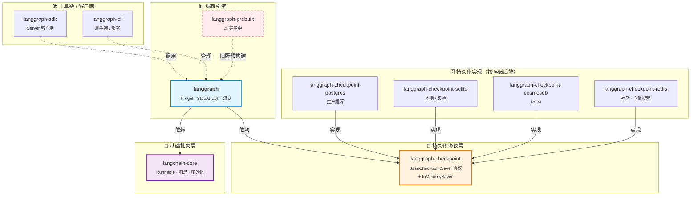
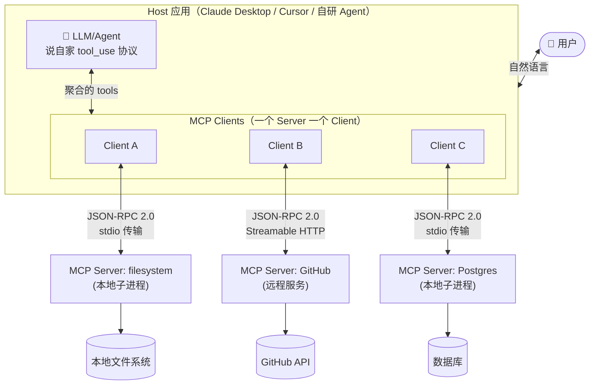
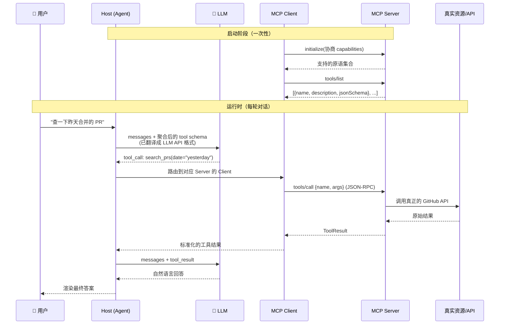

# LangGraph
>
> 官方文档链接：<https://docs.langchain.com/oss/python/langgraph/overview>

定义：底层级的、专门构建管理和部署长时间运行的、有状态的多Agent的编排框架和运行时。

4个核心要素：

- 图：工作流蓝图整体进行编排，定义节点和边的结构。
- 节点：表示系统中的一个实体，可以是一个任务、一个服务或一个代理。
- 边：表示节点之间的关系或依赖，用于定义数据流或控制流。可以根据当前的状况决定下一步执行哪些函数可以是条件分支也可以是固定的状态转换。
- 状态：表示节点在执行过程中的当前状态，用于管理和跟踪任务的进展。

一些LangGraph的核心能力：

- **持久执行**
- **Human-in-the-loop**
- **全面的记忆系统**
- **实时的流式输出**
- **灵活的控制流**
- **LangSmith集成调试**

这些核心能力后面展开详细解释。

最常被问到的问题：和LangChain比较区别在哪？

- LangChain是DAG，LangGraph是状态机。前者无法处理非线性的逻辑。
- 多个步骤之间维护状态很难（状态管理机制）
- 无法根据调用链其中的某一步的结果动态调整执行路径（多条件路由，基于运行时结果进行动态决策，是agentic的重要特性）
- LangChain无法支撑多个Agent协同工作（LangGraph以图编排的形式天然适合多Agent协作甚至是层级架构）

当然并不是说有了LangGraph就能抛弃LangChain，两者其实是互补的关系，如下表：

| 维度 | LangChain | LangGraph |
| --- | --- | --- |
| 定位 | LLM 应用的基础框架和组件库 | 复杂 Agent 工作流的编排引擎 |
| 架构 | 链式/管道式（DAG，有向无环图） | 图结构（支持循环、分支、回溯） |
| 状态管理 | Memory 组件，适合简单多轮对话 | 集中式状态系统，支持回滚和完整历史 |
| 适用场景 | RAG、问答、摘要、简单 chatbot | 多 Agent 系统、长时间运行任务、复杂决策 |
| 复杂度 | 上手快，适合原型和线性任务 | 学习曲线较陡，适合生产级复杂系统 |
| 关系 | 提供基础组件（模型、工具、提示词等） | 基于 LangChain 构建，可使用其所有组件 |

## 核心库和生态

| 包名 | 功能 |
| --- | --- |
| `langgraph` | 主包：图执行引擎（Pregel）、`StateGraph` API、状态管理、控制流、流式输出 |
| `langgraph-checkpoint` | 持久化基础接口：定义 `BaseCheckpointSaver` 与序列化协议，内置 `InMemorySaver` |
| `langgraph-checkpoint-postgres` | PostgreSQL 持久化实现，**生产环境推荐** |
| `langgraph-checkpoint-sqlite` | SQLite 持久化实现，本地开发与实验用 |
| `langgraph-checkpoint-cosmosdb` | Azure Cosmos DB 持久化实现 |
| `langgraph-checkpoint-redis` | Redis 持久化实现（社区），支持跨线程向量搜索 |
| `langgraph-sdk` | 客户端 SDK，与 LangGraph Server 通信 |
| `langgraph-cli` | 命令行工具：项目创建、本地开发、构建部署 |
| `langgraph-prebuilt` | 预构建 Agent 组件（⚠ 弃用中，迁移至 `langchain.agents`） |
| `langchain-core` | 基础抽象层（`Runnable`、消息类型、序列化） |

### 核心库依赖与分层关系

按照「**基础抽象 → 编排引擎 → 持久化协议 → 持久化实现 → 工具链**」分层，可以把这些包的关系画成下图：



读图要点：

- **`langchain-core` 是地基**——`langgraph` 用它的 `Runnable` / 消息抽象，所以 LangGraph 节点天然能复用 LangChain 的 chain、tool、prompt 组件。
- **`langgraph-checkpoint` 是协议层**——只定义 `BaseCheckpointSaver` 接口和内存默认实现。真正持久化由 `-postgres / -sqlite / -cosmosdb / -redis` 这几个**可替换实现**完成，选型只看存储后端。
- **`langgraph` 主包不强绑某个存储**——开发期用 `InMemorySaver`，上生产换 `PostgresSaver`，业务代码 0 改动。
- **`langgraph-sdk` 与 `langgraph-cli` 在外围**——SDK 是远程调用 LangGraph Server 用的，CLI 是脚手架/部署用的，都不参与图执行本身。
- **`langgraph-prebuilt` 正在被废弃**——预构建 Agent 已迁移到 `langchain.agents`，新代码不要再直接依赖它。

## 配套工具链

1. LangSmith：官方的监控和调试平台，支持 LangGraph 的可视化执行跟踪、状态检查、日志分析等功能。
2. LangGraph Studio：官方的图形化开发环境，提供可视化的图编辑器、调试工具和部署管理界面，简化多 Agent 系统的开发和运维。
3. MCP适配器langchain-mcp-adapters：提供与LangChain MCP框架的集成，允许开发者在LangGraph中使用MCP定义的Agent和技能，实现更复杂的Agent-to-Agent交互和协作。
4. LangSmith Deployment：官方提供的云端部署解决方案，支持一键部署LangGraph应用到云环境，简化生产环境的上线和管理流程。

## 与主流框架对比

> 数据时点：2026-05。Agent 框架生态变化很快，下表只反映当前主流社区共识；选型前最好再核对一遍各项目最新 README。

| 维度 | **LangGraph** | **CrewAI** | **AutoGen** |
| --- | --- | --- | --- |
| **维护状态** | LangChain 官方主推；`langgraph 0.4` + LangGraph Platform 已 GA | crewAIInc 维护，1.10.x，Flows 为主推架构 | ⚠ **已分裂**：Microsoft 版 v0.4（事件驱动 Actor）已进入维护模式，将并入 **Microsoft Agent Framework**（2025-10 宣布）；原作者团队 fork 出 **AG2**（社区版）继续演进 |
| **核心范式** | **图 + 状态机**：`StateGraph` 显式建图，节点 = 函数 / LLM 调用，边 = 控制流（条件、循环、回溯） | **角色 + 任务**：Agent 按角色分工，Crew 编排任务；Flows 提供事件驱动的"start/listen/router"模型 | **多 Agent 对话**：以 `GroupChat` / 消息广播 / Swarm 为核心，靠对话推进任务 |
| **状态管理** | 集中式 `State` 字典，强类型 + reducer；Checkpointer 协议天然支持回滚、恢复、时间旅行 | Flows 内置状态持久化与恢复；早期 Crew 单纯靠 Memory 组件 | 状态隐含在消息历史里，无强制集中 State；AG2 在 1.0 路线图里在补强 |
| **生产部署难度** | **中**：自建可用 `langgraph deploy`（Docker），托管走 LangGraph Platform（Cloud / Hybrid / Self-hosted 三档） | **低**：CrewAI Enterprise 提供托管，社区版 Flows 部署快（号称 10 分钟上线一个 Flow） | **中高**：Microsoft 版与 Azure / Agent Framework 绑定深；AG2 自由度高但要自建运维 |
| **学习曲线** | **陡**（约 10–14 天）：要理解图、State reducer、Checkpoint、Pregel 调度 | **浅**（约 2–3 天）：DSL 直观，能用 YAML 描述 Crew | **中**（约 5–7 天）：对话模式概念多，v0.4 重写后 API 又变了一次 |
| **可观测性** | **强**：原生 LangSmith 集成（tracing / evals / replay / Studio 可视化） | 内置 events / tracing，集成 Datadog、LangDB、Maxim、Mem0 等 | 较弱：v0.2 几乎没有；v0.4 / AG2 在补，但仍要自接外部 trace |
| **最佳使用场景** | 长时间运行任务、HITL 审批流、需要严格状态控制 / 可回滚的生产 Agent；与 LangChain 生态集成深 | 业务流程自动化、客服 / 营销 / 内容生产等**角色分工清晰**的多 Agent 协作；快速原型 | 研究场景的多方对话 / 共识 / 辩论；**新项目谨慎入场**，建议直接评估 AG2 或 Microsoft Agent Framework |

### 关于 AutoGen 生态的避坑提示

如果在简历或面试中提到 AutoGen，务必区分清楚下面三个名字，**它们不是一个东西**：

| 名称 | 维护方 | 包名 | 现状 |
| --- | --- | --- | --- |
| **AutoGen 0.2**（原版） | 原 Microsoft 团队 | `pyautogen` | 已停更，被分叉为 AG2 |
| **AutoGen 0.4** | Microsoft | `autogen-agentchat` 等新包 | 维护模式，将并入 Agent Framework |
| **AG2** | 原作者社区团队（已离开 MS） | `ag2` / `autogen` / `pyautogen`（PyPI） | 活跃，向 1.0 演进，兼容 0.2 代码 |
| **Microsoft Agent Framework** | Microsoft | `agent-framework`（新） | 由 AutoGen + Semantic Kernel 合并而来，2026 Q1 GA |

### 一句话选型

- **要上生产、要可回滚、要 HITL** → **LangGraph**
- **要快、要业务流程友好、要少写代码** → **CrewAI**
- **要做研究 / 多 Agent 辩论** → 直接看 **AG2** 或 **Microsoft Agent Framework**，跳过 AutoGen 老版本

## 图结构设计与状态管理

先细化下四个核心要素的细节：

1. 图定义整体工作流结构，组织边和节点，最后编译成一个可执行对象。编译的过程确定以下几件事：**验证所有节点都已经注册，检查边的合法性，检测是否不可达到的边和节点，拓扑排序确定执行计划，以及可选的绑定chechpointer持久化后端的能力**。
2. 节点是图中的计算单元，可以理解为一个节点是一个函数，读当前的State，执行一些逻辑（调用LLM、工具、外部API等），然后返回一个结果。节点之间通过边连接，边定义了执行的顺序和条件。**节点必须更改State**，最小更改即使加个计数器，同时节点可以同步或者异步执行。
3. 边有直接边和条件边，直接边表示无条件执行，条件边则根据State中的某个值进行判断，满足条件才会执行对应的节点。这种设计使得图结构非常灵活，可以支持复杂的控制流，如循环、分支和回溯。
4. 状态State是一个集中式的字典，所有节点都可以访问和修改这个状态，类似一个全局变量。状态管理机制支持回滚和恢复，使得系统能够处理长时间运行的任务和复杂的多 Agent 协作场景。

整个图的执行有三种方式：

```python
# 1. 直接执行
result = graph.invoke()
# 2. 流式输出
for output in graph.stream():
    print(output)
# 3. 异步流执行
async for output in graph.astream():
    print(output)
```

### State Schema 设计

| 方式 | 特点 | 适用场景 |
| --- | --- | --- |
| `TypedDict` | 轻量、支持部分更新、Reducer 语义清晰 | **生产首选**，大多数场景 |
| `dataclass` | 支持默认值、类型提示 | 需要默认值的场景 |
| Pydantic `BaseModel` | 运行时类型验证、自动类型转换 | 对输入校验要求严格的场景（如 API、配置） |

- TypedDict默认生产方案，轻量无开销，Reducer 语义清晰，适合大多数场景，LangGraph的Message和State都基于TypedDict实现。

> State 更新的重要原则：node **不要直接修改 State**，而是返回一个**新的 State 片段**，由 **Reducer** 统一合并。这样可以保证状态更新的可控性和可追踪性，同时也方便实现回滚和时间旅行等高级功能。

#### Reducer 是什么?

**Reducer = State 字段的"合并函数"**：`reducer(old_value, new_value) -> merged_value`。每个字段可以有自己的 reducer，框架根据 `Annotated[类型, reducer]` 的类型注解发现它。

| 字段声明 | node 返回 `{"x": new}` 时的行为 |
| --- | --- |
| `x: int`（无 reducer，默认） | `state["x"] = new` —— 直接覆盖 |
| `x: Annotated[list, operator.add]` | `state["x"] = old + new` —— 列表拼接 |
| `x: Annotated[list, add_messages]` | 追加消息 + 按 `id` 去重合并（聊天必用） |
| `x: Annotated[int, lambda o,n: o+n]` | 累加器 |

代码示例：

```python
from operator import add
from typing import Annotated, TypedDict

from langchain_core.messages import AIMessage, HumanMessage
from langgraph.graph.message import add_messages


class State(TypedDict):
    user_id: str                                          # 无 reducer：覆盖
    messages: Annotated[list, add_messages]               # 追加 + 去重
    sources: Annotated[list[str], add]                    # 列表拼接
    counter: Annotated[int, lambda old, new: old + new]   # 累加


# 假设当前 State：
# {"user_id": "u1", "messages": [HumanMessage("你好")], "counter": 5, "sources": ["doc-a"]}

def chat_node(state: State):
    # ❌ 错误示范：直接 mutate，绕过 reducer，checkpoint 会不一致
    # state["messages"].append(AIMessage("你好！"))
    # state["counter"] += 1
    # return state

    # ✅ 正确：返回"片段"，由 reducer 合并
    return {
        "messages": [AIMessage("你好！")],   # add_messages 会追加，不是替换
        "counter": 1,                        # lambda 会累加：5 + 1 = 6
        "sources": ["doc-b"],                # operator.add 会拼接：["doc-a", "doc-b"]
        # user_id 没返回，保持不变
    }
```

执行后 State 变成：

```python
{
    "user_id": "u1",                                              # 未变
    "messages": [HumanMessage("你好"), AIMessage("你好！")],      # 追加
    "counter": 6,                                                 # 累加
    "sources": ["doc-a", "doc-b"],                                # 拼接
}
```

**最常用的 `add_messages`** 来自 `langgraph.graph.message`，是聊天类 Agent 的默认 reducer，做了三件事：

1. **追加**新消息
2. **按 `id` 去重合并** —— streaming 中途修改 / tool 结果回填时不会重复
3. **类型规范化** —— dict 形态消息自动转 `BaseMessage` 子类

LangGraph 自带的 `MessagesState` 本质就是：

```python
class MessagesState(TypedDict):
    messages: Annotated[list[AnyMessage], add_messages]
```

> Reducer 这个词来自 Redux / 函数式编程，思想都是"状态变更必须通过纯函数完成"。在 LangGraph 里它直接支撑了 **checkpoint / 回滚 / 时间旅行**——一旦在 node 里 `state[k].append(...)` 直接 mutate，就绕过了 reducer，checkpointer 拿到的"片段"和真实 State 对不上，时间旅行就会拿到错的中间态。

#### 原理：reducer 是怎么被"触发"的？

初学时容易困惑——`State` 只是作为参数传进 node，**为什么 node 一返回 dict，就会自动调用注解里的 reducer**？这不是闭包，也不是什么装饰器魔法，而是 Python 标准的「**运行时类型反射**」。

**两个完全分离的阶段**：

```text
[阶段 1] 编译期 (StateGraph.compile)：
         LangGraph 读 State 类的注解 → 提取出 {字段名: reducer} 映射表 → 存起来

[阶段 2] 运行期 (node 返回 dict 之后)：
         LangGraph 遍历 dict 的 key → 查上一步的映射表 → 主动调用 reducer 合并
```

注解**自己什么都不做**，它只是"贴"在类上的元数据。**真正干活的是 LangGraph**——它主动用 `typing` 模块的 API 把注解读出来、再主动调用 reducer。

##### `Annotated` 到底是什么

```python
from typing import Annotated

x: Annotated[int, "hello", 42, my_func]
```

`Annotated[T, m1, m2, ...]` 等价于"类型还是 T，但**附带一串任意元数据**"。这些元数据**对类型检查器没意义**（mypy 看到的 `x` 类型就是 `int`），但**可以在运行时被读出来**：

```python
from typing import Annotated, TypedDict, get_type_hints


class State(TypedDict):
    counter: Annotated[int, lambda o, n: o + n]


hints = get_type_hints(State, include_extras=True)
#                              ^^^^^^^^^^^^^^^^^^ 关键！默认 False 会丢掉元数据

# hints == {"counter": Annotated[int, <lambda>]}

hints["counter"].__metadata__
# == (<lambda>,)   ← reducer 在这里
```

**`include_extras=True`** 是关键开关——不开它，`get_type_hints` 会把 `Annotated[int, foo]` 退化成 `int`，元数据就丢了。LangGraph 内部就是开着这个标志读 State 的。

##### MiniGraph：用 30 行代码还原 LangGraph 的反射机制

下面这个 `MiniGraph` 跑得通，逻辑和 LangGraph 内部等价（去掉了 checkpoint / 并行 / pregel 调度，只保留 reducer 这一条链路）：

```python
from operator import add
from typing import Annotated, TypedDict, get_type_hints


class State(TypedDict):
    user_id: str                                          # 无注解 → 覆盖
    sources: Annotated[list[str], add]                    # 用 operator.add 合并
    counter: Annotated[int, lambda o, n: o + n]           # 累加


class MiniGraph:
    def __init__(self, state_cls):
        # ===== 阶段 1：编译期，反射出 {字段名: reducer} =====
        hints = get_type_hints(state_cls, include_extras=True)
        self.reducers = {}
        for field, hint in hints.items():
            md = getattr(hint, "__metadata__", None)
            self.reducers[field] = md[0] if md else None   # 没注解就是 None=覆盖

    def step(self, state: dict, node_fn):
        """模拟一次 node 执行 + reducer 合并"""
        update = node_fn(state)                            # node 返回 State 片段
        new_state = dict(state)
        # ===== 阶段 2：运行期，按字段查 reducer，逐字段合并 =====
        for k, new_val in update.items():
            reducer = self.reducers.get(k)
            if reducer is None:
                new_state[k] = new_val                     # 覆盖
            else:
                old_val = state.get(k, _default_for(reducer))
                new_state[k] = reducer(old_val, new_val)   # ⭐ 真正"触发"reducer
        return new_state


def _default_for(reducer):
    # 简化：累加器从 0 起，列表从 [] 起；真实 LangGraph 用类型推断更精细
    return 0 if reducer.__name__ == "<lambda>" else []


def my_node(state):
    return {"counter": 1, "sources": ["doc-b"]}            # 只返回片段


graph = MiniGraph(State)
print(graph.reducers)
# {'user_id': None, 'sources': <built-in function add>, 'counter': <lambda>}

s0 = {"user_id": "u1", "counter": 5, "sources": ["doc-a"]}
s1 = graph.step(s0, my_node)
print(s1)
# {'user_id': 'u1', 'counter': 6, 'sources': ['doc-a', 'doc-b']}
```

跑一遍立刻就懂：

- `MiniGraph(State)` 这一行就是**编译期的反射**——只发生一次，把 reducer 映射表建好。
- `graph.step(...)` 里的 `reducer(old_val, new_val)` **才是真正"触发"的瞬间**——LangGraph 主动调用的，跟"注解"本身没关系。

##### 为什么这不是闭包?

| 概念 | 它是什么 |
| --- | --- |
| **闭包** | 函数捕获外层作用域的变量。例：`def outer(): x=1; def inner(): return x; return inner` |
| **`Annotated` 元数据** | 写死在类定义里的常量值，**附挂**在类型上，不持有任何外层状态 |
| **`get_type_hints` 反射** | 运行时**读类的属性**，把附挂的元数据取出来用 |

reducer **不是被注解"调用"的**——它就是一个**普通函数对象**，被存放在 `State.__annotations__["counter"].__metadata__[0]` 这个位置。LangGraph 用 `getattr` 把它取出来，然后**自己调用**它。

##### 一句话类比

把它想成**配置驱动**而不是魔法：

> "State 类不是数据结构，是一份**声明式配置**——告诉 LangGraph 每个字段该怎么合并。LangGraph 在 `compile()` 时把这份配置加载到内存，运行时按表查 reducer 调用。"

完全等价于你手写一个：

```python
REDUCERS = {
    "counter": lambda o, n: o + n,
    "sources": add,
}
```

只不过用 `Annotated` 写**和类型定义在一起**，更内聚、能被 IDE 类型推断、不会出现"忘了同步 REDUCERS"的 bug。这是 Python 现代框架（FastAPI 的 `Depends`、Pydantic 的 `Field`、SQLAlchemy 2.x 的 `Mapped[...]`）的通用套路——**"类型即配置"**。

> 总结一下，State设计主要看以下几点：state信息是否会被并行更新（会的话就要用reducer），state字段的默认值（dataclass和pydantic支持，TypedDict不支持），是否需要运行时校验（需要的话就用pydantic）。如果是消息列表用LangGraph默认add_messages，普通的列表或者数字用operator.add或者lambda累加器（或者自定义Reducer），其他类型如果没有特殊合并需求就直接覆盖即可。

### Node设计

Node是图中的计算单元，负责执行具体的任务逻辑。设计Node时需要考虑以下几个方面问题：

1. **状态污染**：多个节点同时处理同一状态时，其他节点不应该看到“意外状态”。
2. **状态的不可变性**：节点不应该直接修改共享状态，而是返回新的状态片段。
3. **无法回滚/历史追踪的可能**：如果状态更新不可逆，可能无法追踪历史或回滚操作，其实也就是无论如何不要改变原始状态。

- **Node中的异常处理**

1. 对于**可恢复错误**，可以在Node内部捕获并返回一个特定的状态片段(`return {"output": "error message"}`)，表示错误信息和恢复建议。上层图可以根据这个状态片段决定下一步操作，比如重试、跳过或执行备用节点。
2. 对于**不可恢复错误**，可以让Node抛出异常，LangGraph会捕获这个异常并标记当前执行路径为失败(直接`raise`)。上层图可以定义一个全局的错误处理节点，当任何子节点抛出异常时，都会跳转到这个错误处理节点进行统一处理，比如记录日志、发送通知或执行清理操作。

- **常见Node分类**

1. **LLM Node**：调用语言模型进行文本生成或理解的节点，输入通常是提示词和上下文，输出是模型的响应。
2. **Tool Node**：调用外部工具或API的节点，输入是工具的参数，输出是工具的结果。
3. **Decision Node**：根据当前状态做出决策的节点，输入是状态信息，输出是决策结果（比如条件分支的结果）。
4. **Human Node**：需要人工干预的节点，输入是需要人工处理的信息，输出是人工提供的结果。
5. **Composite Node**：聚合节点，收集多个并行节点的结果进行汇总处理，输入是多个子节点的输出，输出是汇总后的结果。

- **Node设计最佳原则**

1. **单一职责**：每个Node应该只负责一个明确的任务，避免过于复杂的逻辑。
2. **幂等性**：Node的执行应该是幂等的，即多次执行同样的输入应该得到同样的输出，避免副作用。
3. **使用日志**：在Node内部添加日志记录，方便调试和监控。
4. **输入输出规范**：定义清晰的输入输出格式，确保不同Node之间的接口一致，便于组合和重用。

### Edge与控制流设计

串联、分支和汇聚比较简单，着重讲下条件边、循环（回溯）和终止。

#### 条件边

是一个函数，能让router node动态选择下一个要执行的节点。条件边的函数接受当前状态作为输入，返回一个布尔值或一个标签，指示应该执行哪个节点。

```python
def condition(state):
    pass

graph.add_conditional_edges(
    source = "node_a", # 来源节点
    path = condition,  # 条件/路由函数，根据当前状态决定走哪条边
    path_map = {       # 条件映射表，case1...是condition函数的返回值，value是对应的目标节点
        "case_1": "node_b",
        "case_2": "node_c",
        "default": "node_d"
    }
)
```

> 注意这只是一种写法，条件函数直接返回要走的node的标签也是一种写法。

**Command边**比起条件边更进一步，它不仅决定下一步走哪个节点，还能携带参数直接传给下一个节点，适合需要动态传参的场景。

```python
from langgraph.types import Command

def dynamic_router(state: State) -> Command:
    ...
    return Command(
        goto="node_b",  # 要跳转的目标节点标签
        update={[...]}
    )
```

需要注意的是该方法复杂度高，适合Agentic场景，普通的条件分支用条件边就够了。

#### 循环（回溯）

循环和终止条件的设计是LangGraph相较于传统DAG框架的核心优势之一。也是常见的self-correction场景的关键。实现的思路除了基本的条件边以外还有两种重要的思路：**循环计数器模式**和**复杂终止**。

- 循环计数器：在State里设计一个循环计数器字段，每次进入循环时由Node更新这个计数器，条件边根据计数器的值决定是否继续循环或跳出循环。（`if state.get('cnt',0) >= MAX_ITERATIONS raise ...`）
- 复杂终止：设计一个专门的终止节点，所有需要循环的节点都可以通过条件边指向这个终止节点。每次进入循环时，Node会更新State中的一个字段（比如错误计数器或状态标志），条件边根据这个字段的值决定是否跳转到终止节点。一句话解释就是类似一个Switch节点。

自循环的设计参考`stage2-advanced/04-langgraph/02_module_graph/01_reflection_loop.py`。

### 复杂图结构模式

实际生产中为了性能有可能需要并行执行某些节点，或者需要在图中复用某些子图（比如一个通用的审查流程）。

#### 并行执行

Super-step: Pregel算法的核心思想是把图的执行分成多个super-step，每个super-step里所有节点并行执行。每个节点在自己的super-step里读状态、执行逻辑、返回更新，框架负责在super-step结束时统一合并状态更新。

人话就是：

1. 并行节点更新同一字段，必须用 reducer 来合并，不能直接覆盖。
2. LangGraph使Send()和Receive()节点成为并行执行的边界，Send节点发送消息后就不管了，Receive节点会等所有并行路径的消息都到齐才继续执行。

#### 循环结构

回看上方的自循环结构即可。

#### 分层结构

LangGraph支持图中嵌套图的设计，子图可以被多个父节点复用。子图的输入输出通过特殊的"接口节点"（InputNode和OutputNode）来定义，父节点通过边连接到子图的接口节点来传递数据。

> 注意： 子图和主图的state通过同名字段自动映射。

## 工具系统与Agent增强

### 工具系统

工具系统其实和RAG一样是拓展LLM能力边界的手段。LangGraph中使用`langchain.tools`中的`@tool`装饰器来定义工具函数，这些工具函数可以在图的节点中被调用。工具函数的输入输出会自动被序列化和反序列化，方便在图中使用。

```python
from langchain.tools import tool
@tool("search")
def search(query: str) -> str:
    # 实现搜索逻辑
    return "搜索结果"
```

类似于Skill，工具方法的Docstring是直接为LLM调用工具提供指南的最佳实践，LLM会根据Docstring来理解工具的功能和使用方法，从而正确地调用工具。

```python
@tool("calculator")
def calculator(expression: str) -> str:
    """
    这是一个计算器工具，可以计算数学表达式的结果。
    使用场景：
    - 当需要进行数学计算时，可以调用这个工具。
    输入格式：
    - expression: 一个字符串，包含需要计算的数学表达式，例如 "2 + 2"。
    输出格式：
    - 返回一个字符串，表示计算结果，例如 "4"。
    注意事项：
    - 确保输入的表达式是合法的数学表达式，否则可能会导致计算错误。
    """
    # 实现计算逻辑
    return "计算结果"
```

设计的原则很简单：**功能描述，使用场景，参数的具体说明，返回值的说明以及拓展的注意事项。**

如果参数非常复杂，考虑使用Pydantic模型进行强类型验证，具体做法参考`stage2-advanced/04-langgraph/03_module_tools/01_tool_basics/03_pydantic_args.py`。

- **ToolRuntime**统一上下文，为工具提供运行时对**状态、上下文、存储、流式处理、配置和工具调用ID时间**全盘访问。好处是不需要显式的传递或者显示全局的状态，符合我们之前提到的State的设计原则。

参考代码`stage2-advanced/04-langgraph/03_module_tools/02_tool_runtime`下的示例，对工具如何访问这几个全局变量的方法都做了演示。

- **工具的执行和错误处理**
工具方法也分同步和异步，同步的任务已经见了很多，这里给一个异步的例子(把方法变成async就行)：

```python
import aiohttp

@tool
async def async_fetch(url: str) -> str:
    """
    这是一个异步工具，用于从指定URL获取数据。
    使用场景：
    - 当需要从网络上获取数据时，可以调用这个工具。
    输入格式：
    - url: 一个字符串，表示需要访问的URL地址，例如 "https://api.example.com/data"。
    输出格式：
    - 返回一个字符串，表示从URL获取的数据内容。
    注意事项：
    - 确保输入的URL是合法的，并且目标服务器可访问，否则可能会导致请求失败。
    """
    async with aiohttp.ClientSession() as session:
        async with session.get(url) as response:
            return await response.text()
```

实践中一定会涉及同步和异步的选取，简单来说计算密集型的任务（如复杂的文本处理、数据分析等）适合使用同步工具，而IO密集型的任务（如网络请求、大文件操作、数据库读写等）则更适合使用异步工具。

对于错误处理，通常用`tenacity`的`retry,stop_after_attempt,wait_expotential`来修饰工具函数，来实现自动重试和指数退避等功能。

```python
from tenacity import retry, stop_after_attempt, wait_exponential
from langchain.tools import ToolException

@tool
@retry(stop=stop_after_attempt(3), wait=wait_exponential(multiplier=1, min=2, max=10))
def unreliable_tool(param: str) -> str:
    ... # 实现可能会失败的工具逻辑
    except Exception as e:
        raise ToolException(f"工具执行失败: {str(e)}")
```

> 一个注意点：在ToolRuntime下参数config和runtime是保留的，不能被工具函数的参数列表占用，否则会导致运行时错误。tool方法的形参不能出现`config`和`runtime`，如果需要访问工具运行时上下文应该通过ToolRuntime对象来访问。

### Agent与工具集成

LangChain新版本中的创建新Agent的范式已经改变，具体可以参考`stage2-advanced/04-langgraph/03_module_tools/03_agent_integration/01_create_agent.py`.

为了更方便的处理来自LLM的工具调用，LangGraph提供了`ToolNode`方便我们在构建图的过程中处理工具调用，我们不需要重复在图中编写如何选择工具并调用的逻辑，只需要绑定工具，用ToolNode包装工具调用然后用`tools_condition`自动处理工具调用即可。

ToolNode会并行处理LLM返回的多个工具调用，匹配对应的工具函数、提取对应的参数并行执行这些工具调用最后格式化成ToolMessage返回给LLM。具体可以参考`stage2-advanced/04-langgraph/03_module_tools/03_agent_integration/03_toolnode_parallel.py`。

### Middleware系统

我们要理解一点，langGraph的agent和一般的graph节点是不一样的，`create_agent`内部其实是一个预制好的 StateGraph：

```bash
START → agent_node(call_model) ─┬─ tools_condition → END
                                └─ tools_node → 回到 agent_node
                                        ↑ 这个循环是 create_agent 帮你封死的
```

自定义State的例子中提到，AgentState的方案不如middleware是因为AgentState虽然也能存状态，但它的生命周期和agent_node绑定在一起，无法跨越工具调用的边界。而middleware是全局的，可以在agent_node和tools_node之间共享状态，适合处理工具调用的上下文信息。

假设该场景，我们需要在state里加一个模型调用次数的计数器，要在每轮模型调用前+1，方案有：

- 每个tool里return `{"cnt": +1}`，一方面污染tool增加无关的业务逻辑，而且tool不一定每次都被模型调用。
- 自定义model.invoke的方法，但是相当于把agent层的责任转嫁给模型层，不合适
- 不用create_agent，自己写agent的图结构，虽然可行但失去了create_agent的便利性

Middleware相当于在agent_note和tool逻辑之间预留了几个固定时刻的hook：

```bash
before_model → call_model → after_model → tools_condition
                                            ↓
                              before_tool → call_tools → after_tool
                                            ↓ (loop back)
```

可以对比create_agent的那个图来理解，middleware就是一个官方的AOP方案，所有需要横切的逻辑都可以放在整个middleware中，比如：**计数 / 截断 / guardrail / 审计 / token / 预算 / 重试**.

> 总结一下，对于Agent使用的场景，如果只读不写，state_schema直接传可以，如果涉及截断或者需要更新，middleware。

重点是要记住主要的Hook风格、执行时机和实际用途：

- Node-style hooks:

1. `before_agent`:在agent_node执行前触发，适合做一些agent级别的准备工作，比如初始化状态、权限检查。
2. `before_model`:在模型调用前触发，适合做一些模型级别的准备工作，比如输入预处理、日志记录。
3. `after_model`:在模型调用后触发，适合做一些模型级别的后处理工作，结果校验和计数。
4. `after_agent`:在agent_node执行后触发，适合做一些agent级别的收尾工作，比如状态清理、总结Agent执行表现等。

- Wrap-style hooks:

1. `wrap_model_call`: 在模型调用时触发，可以完全控制模型调用的过程，适合做一些需要包裹整个模型调用的逻辑，比如重试、缓存、动态路由。
2. `wrap_tool_call`: 在工具调用时触发，可以完全控制工具调用的过程，适合做一些需要包裹整个工具调用的逻辑，比如降级、监控、错误处理。

```python
agent = create_agent(
    model = model,
    middleware = [middleware1,middleware2,middleware3]
)
```

对于上方这段伪代码，这些middleware的执行顺序的心智模型应该是这样的：

```bash
  START
  │
  ├─ before_agent          M1 → M2 → M3         (只在 agent 入口跑一次)
  │
  │ ┌──[ loop iteration 1 ]────────────────────────────────────────┐
  │ │
  │ │ before_model         M1 → M2 → M3         (每轮都跑)
  │ │
  │ │ wrap_model_call      洋葱嵌套:
  │ │   M1 pre
  │ │     M2 pre
  │ │       M3 pre
  │ │         ▶ 真正的 model.invoke
  │ │       M3 post
  │ │     M2 post
  │ │   M1 post
  │ │
  │ │ after_model          M3 → M2 → M1         (倒序!)
  │ │
  │ │ tools_condition      若有 tool_calls →
  │ │
  │ │ wrap_tool_call       洋葱嵌套:
  │ │   M1 pre
  │ │     M2 pre
  │ │       M3 pre
  │ │         ▶ 真正的 tool 执行
  │ │       M3 post
  │ │     M2 post
  │ │   M1 post
  │ │
  │ └──── loop back to before_model ────────────────────────────────┘
  │
  │ ┌──[ loop iteration N（最终，无 tool_calls）]────────────────────┐
  │ │ before_model  → wrap_model_call → after_model → 退出循环
  │ └────────────────────────────────────────────────────────────────┘
  │
  ├─ after_agent           M3 → M2 → M1         (只在 agent 出口跑一次)
  │
  END
```

> 总结下，node-style符合栈的调用顺序（进正出倒），wrap-style是洋葱模型。

给一个具体的例子比如：

```bash
M1 = TraceMiddleware        # 开 span / 关 span
M2 = RateLimitMiddleware    # 抢配额 / 还配额
M3 = CounterMiddleware      # +1 计数 / 记录耗时

每轮 model 调用实际顺序：

before_model: open_span → acquire_quota → start_timer
            ── 真正 model.invoke ──
after_model : stop_timer → release_quota → close_span
```

#### 内置中间件

LangGraph(`langchain.agents.middleware`)提供了一些内置的中间件，涵盖了常见的功能需求：

| 中间件 | 功能描述 | 适用场景 |
| --- | --- | --- |
| **SummarizationMiddleware** | 自动总结对话历史，控制输入长度 | 长对话场景，避免上下文过长 |
| **PIIMiddleware** | 自动检测和脱敏敏感信息 | 处理用户隐私数据的场景 |
| **ToolCallLimitMiddleware** | 限制工具调用次数，防止滥用 | 需要控制成本或资源的场景 |

其他常见的中间件，读文档学习：<https://docs.langchain.com/oss/python/langchain/middleware/built-in>

#### 自定义中间件开发

常见几种方式：

1. 官方的装饰器(适用于简单场景)
2. 自定义类（复杂场景，特别是需要多个hook在一起，需要init配置，需要同步/异步同名hook或者跨项目复用的场景）
3. Wrap-style Hook（适合重试、缓存和转换，拦截执行并在调用处理程序时控制其行为。）
4. Agent jumps（提前退出或者跳转的场景）
5. 自定义State schema（继承重载AgentState，增加多个字段，让多个hook共享）

具体代码参考`stage2-advanced/04-langgraph/03_module_tools/04_middleware`下的代码。

### MCP协议

MCP(Model Context Protocol)协议是一个开放的用于标准化应用向大模型提供工具、上下文和资源的方式。
核心优势如下：

1. **统一接口**：MCP定义了一套标准接口，应用可以通过这个接口向任何支持MCP的模型提供工具和上下文，无需针对不同模型做适配。本质是把"每个客户端为每个工具单独写适配"的 M×N 集成问题降为 M+N。
2. **灵活部署**：MCP支持多种部署方式，既可以在本地部署，也可以通过云服务使用，适应不同的应用场景。实际传输层主要是两种：**stdio**（本地子进程，最常见）和 **Streamable HTTP**（远程/网络，已取代旧的 SSE 传输）。
3. **跨语言生态**：MCP协议设计为语言无关的，支持多种编程语言，方便开发者在不同技术栈中使用。官方 SDK 覆盖 Python / TypeScript / Java / Kotlin / C# / Swift / Rust。
4. **多服务编排**：应用可以同时挂载多个 MCP Server，把它们暴露的工具/资源/提示聚合起来喂给同一个 Agent。注意"编排"由 Host（宿主应用）完成 —— MCP 协议本身只规定 Client 与 Server 之间的点对点双工通道。

#### 三大原语（Primitives）

MCP 不只是远程 tool calling，还规定了三类暴露给 Host 的能力，触发方分别不同：

| 原语 | 谁触发调用 | 典型用途 |
|---|---|---|
| **Tools** | LLM 自主决策调用 | `search_files`、`run_sql`、`create_issue` |
| **Resources** | Host / 用户决定何时拉取（也可由模型主动请求） | 一个文件的内容、一份 DB schema、一段日志 |
| **Prompts** | 用户主动选择 | "代码 review 模板"、"会议纪要生成器" |

#### 三层角色：Host / Client / Server

务必区分清楚 —— 这是 MCP 文档里最容易让人混淆的点：

- **Host**：你的应用程序（Claude Desktop / Cursor / 自研 Agent / IDE 插件）
- **Client**：Host 内部的一个连接管理器，**一个 Server 对应一个 Client 实例**
- **Server**：独立进程，暴露 tools / resources / prompts

注意 LLM **不直接说 MCP**。模型只懂它自己 API 的 tool_use 格式（OpenAI / Anthropic schema）。MCP 协议跑在 **Host ↔ Server** 之间，Host 负责双向翻译：把 MCP `tools/list` 结果转成模型 API 的 tool schema 喂给 LLM；再把模型返回的 tool_call 转回 MCP 的 `tools/call` 请求。

底层基于 **JSON-RPC 2.0**，且双向 —— Server 也能反向调用 Client（典型场景：`sampling`，Server 请求 Host 帮自己跑一次 LLM 推理）。

#### MCP 核心架构图

组件结构（一个 Host 同时挂载多个 Server）：



完整调用链路（一次工具调用的时序）：



关键点回顾：

- **每个 Client 只连一个 Server**，多 Server 靠多 Client 横向并存；
- **LLM 视野里没有"MCP"这个词**，看到的是被 Host 翻译过的 tool schema；
- **Server 可以反向调 Client**（sampling / elicitation 等场景）；
- 工具的真正执行发生在 **Server 进程内**，Host 只是搬运 JSON。

#### 客户端集成示例

- 连接多个MCP服务器：`stage2-advanced/04-langgraph/03_module_tools/05_mcp/clients/multi_server.py`
- 加载资源: `stage2-advanced/04-langgraph/03_module_tools/05_mcp/clients/load_resources_prompts.py`

#### 自定义MCP Server示例(使用FastMCP)

参考代码路径：`stage2-advanced/04-langgraph/03_module_tools/05_mcp/servers`

- transport 类型的选取：

| 场景 | Transport | 理由 |
| --- | --- | --- |
| 本地开发调试 | stdio | 低延迟、简单直接 |
| 生产环境 | HTTP | 易扩展、易监控 |
| Docker 容器 | HTTP | 标准化部署 |
| 跨网络调用 | HTTP | 支持远程访问 |
| IDE 集成 | stdio | 直接集成，无需网络 |

- stateful v.s. stateless client
客户端默认无状态，调用工具创建一个新的MCP会话（session），执行然后清理。这样方便快捷但是无法跨调用共享上下文并且每次都需要重新初始化、验证权限等等。

如果需要控制MCP会话生命周期，可以创建一个 stateful client，手动管理 session 的创建和销毁。这样就可以在多个工具调用之间共享上下文信息（比如用户身份、权限、历史记录等），适合需要复杂交互的场景。

```python
with client.session("math") as session:
    ...
```

整个调用链就变成了：创建session，打开session，调用工具（多次），关闭session，销毁session。这样就能保持会话、共享变量和上下文，也能适配很多需要事物操作的场景了。

具体实践参考`stage2-advanced/04-langgraph/03_module_tools/05_mcp/servers/server_stateful.py`。

#### 核心特性分析

##### 工具Tools

- **结构化内容**：MCP工具可以返回结构化内容以及类可读的本响应。这在工具需要返回机器可解析的数据（如JSON）以及展示给模型的文本时非常有用。(见`stage2-advanced/04-langgraph/03_module_tools/05_mcp/servers/data_server.py`)

对应的客户端示例 —— 启动 `data_server.py` 后（默认 `http://127.0.0.1:8000/mcp`），直接调用工具拆出 `text` 和 `structured_content` 两部分：

```python
"""client_data_server.py — 调用 data_server 的结构化输出工具"""

import asyncio
import json

from langchain_mcp_adapters.client import MultiServerMCPClient


async def main():
    client = MultiServerMCPClient(
        {
            "data": {
                "transport": "streamable_http",
                "url": "http://127.0.0.1:8000/mcp",
            }
        }
    )

    # 拿到工具后直接调用（绕过 LLM，学习阶段最直观）
    tools = await client.get_tools()
    get_user_profile = next(t for t in tools if t.name == "get_user_profile")

    raw = await get_user_profile.ainvoke({"user_id": "u_001"})
    payload = json.loads(raw)         # server 返回的 dict 已被序列化成 JSON 字符串

    print(f"text             : {payload['text']}")
    print(f"structured_content: {payload['structured_content']}")
    # 业务侧用 payload['structured_content']，给 LLM 看 payload['text']


if __name__ == "__main__":
    asyncio.run(main())
```

要点：

- **工具可以绕过 Agent 直接调用**。`client.get_tools()` 返回标准 LangChain Tool，`await tool.ainvoke(args)` 即可调用 —— 学习/单测特别有用，不必搭整套 Agent。
- **`dict` 返回值会被序列化成 JSON 字符串**。FastMCP 把 server 端的 dict 序列化进 ToolResult 的 text content，客户端拿到的是 `'{"text":"...","structured_content":{...}}'`。所以业务侧必须 `json.loads` 才能拿到 `structured_content`，不能直接当对象用。
- **真接到 LLM 的话**，模型看到的是整个 JSON 字符串（包括 `structured_content` 那部分）。生产里通常把"给 LLM 的文本"和"业务自留的结构化数据"分两条通道，避免污染上下文。

完整脚本：`stage2-advanced/04-langgraph/03_module_tools/05_mcp/clients/fetch_user_profile.py`（配 `servers/data_server.py`）

- **多模态内容**：MCP具可以在其响应中返回多模态内容（图像、本等）。当MCP服务器返回包含多个部分的内容（例如本和图像）时，适配器会将其转换为LangChain的标准内容块。您可以通过content_blocks 属性访问标准化的表示形式。例如：

```python
from langchain_mcp_adapters.client import MultiServerMCPClient
from langchain.agents import create_agent

client = MultiServerMCClient({...})
tools = await client.get_tools()
agent = create_agent(model, tools)
result = await agent.ainvoke({"messages"：[{"role"："user"，"content"："截取当前页面的屏幕截图"}]})
#访问多模态内容
for message in result["messages"]:
    if message.type == "tool":
        #以提供方本地格式提供的原始内容
        print(f"Raw content: {message.content}")
        #标准化的内容块
        for block in message.content_blocks:
            if block["type"]== "text":
                print(f'Text: {block['text']}")
            elif block["type"] == "image":
                print(f"'Image URL: {block.get('url')}")
                print(f"Image base64: {block.get('base64', '')[:50]}...")
```

##### 资源获取

资源允许MCP服务器暴露数据一一如文件、数据库记录或API响应一一这些数据可以被客户端读取。LangChain将MCP资源转换为Blob对象，这些对象提供了处理文本和二进制内容的统一接口。参考代码`stage2-advanced/04-langgraph/03_module_tools/05_mcp/servers/files_server.py`。

对应的客户端示例 —— 启动 `files_server.py` 后（默认监听 `http://127.0.0.1:8000/mcp`），用 `MultiServerMCPClient` 拉取静态与参数化两类资源：

```python
"""client_fetch_files.py — 拉取 files_server 暴露的 MCP 资源"""

import asyncio

from langchain_mcp_adapters.client import MultiServerMCPClient


async def main():
    client = MultiServerMCPClient(
        {
            "files": {
                "transport": "streamable_http",
                "url": "http://127.0.0.1:8000/mcp",
            }
        }
    )

    # 1) 列出 server 暴露的所有静态资源（参数化模板不会列出来，需按 URI 拉）
    print("=== files 提供的静态资源 ===")
    blobs = await client.get_resources("files")
    for blob in blobs:
        print(f"- URI: {blob.metadata.get('uri')} | MIME: {blob.mimetype}")
        print(blob.as_string())

    # 2) 按具体 URI 拉取参数化资源 docs://{category}/{filename}
    print("\n=== 按 URI 拉取参数化资源 ===")
    blobs = await client.get_resources(
        "files",
        uris=[
            "config://app.json",                  # 静态资源也能这样点名拉
            "docs://api/getting-started.md",      # 参数化资源
            "docs://tutorial/quickstart.md",
        ],
    )
    for blob in blobs:
        print(f"- URI: {blob.metadata.get('uri')} | MIME: {blob.mimetype}")
        print(blob.as_string())


if __name__ == "__main__":
    asyncio.run(main())
```

关键点：

- **`MultiServerMCPClient` 的配置 dict**：key 是你给 server 起的名字（`"files"`），值里 `transport` 必须对得上 server 端的 `mcp.run(transport=...)`；这里 server 用了 `streamable-http`，客户端就写 `streamable_http`（下划线）。
- **`get_resources(server_name)` 不带 `uris`**：只返回**静态**资源（如 `config://app.json`）。参数化模板（`docs://{category}/{filename}`）必须显式传入完整 URI 才能获取，因为模板里的占位符客户端没法自动展开。
- **返回值是 LangChain `Blob`**：`blob.as_string()` 拿文本；二进制内容用 `blob.data`；元信息（URI、MIME 类型）在 `blob.metadata`。这一层适配是 `langchain-mcp-adapters` 帮你做的，原生 MCP 协议返回的是 `ResourceContents`。

运行步骤（两个终端）：

```bash
# 终端 1：启动 server
uv run python stage2-advanced/04-langgraph/03_module_tools/05_mcp/servers/files_server.py

# 终端 2：跑 client
uv run python stage2-advanced/04-langgraph/03_module_tools/05_mcp/clients/fetch_files.py
```

完整脚本：`stage2-advanced/04-langgraph/03_module_tools/05_mcp/clients/fetch_files.py`（配 `servers/files_server.py`）

##### 提示词模板

提示使MCP服务器能够暴露可重用的提示模板，这些模板可以被客户端检索和使用。LangChain将MCP提示转换为消息，使其易于集成到基于聊天的工作流中。

##### 拦截器（Interceptor）与回调（Callback）—— 进阶但部分必学

`langchain-mcp-adapters` 在客户端侧提供了**拦截器**（对工具调用进行 AOP 包装，类似 agent middleware 的 wrap-style）和**回调**（处理 server 推送的事件，如进度 / 日志 / elicitation）。课程示例代码在 `stage2-advanced/04-langgraph/03_module_tools/05_mcp/advanced/` 下。

**别一刀切当成可跳过**——这堆里有几个是生产硬需求，分两组对待：

▼ **生产必学**（任何要上线的 MCP 集成都跑不掉这三件事）

| 文件 | 解决什么 | 为什么必学 |
|---|---|---|
| `01_interceptor_inject_context.py` | 把 `user_id` / `api_key` 注入到每次工具调用 | 多租户 / SaaS / 任何 per-user 场景的硬需求；不能让 LLM 自己拼 user_id |
| `03_interceptor_auth.py` | 拦截敏感工具做权限校验 | 给 LLM 接外部工具的系统必须有**这一层 guardrail**，否则 prompt injection 就能调危险操作 |
| `04_interceptor_compose.py` | 多个拦截器的**洋葱组合**顺序 | 一旦你写了 >1 个拦截器（auth + tracing + 限流…），执行顺序就是它讲的事，错了就漏拦 |

▼ **按需查阅**（用到再回头看，知道有这能力即可）

| 文件 | 用途 | 何时回来看 |
|---|---|---|
| `02_interceptor_store.py` | 在拦截器里访问 Store 做个性化 | 需要"按用户偏好改工具参数"时 |
| `05_interceptor_command.py` | 拦截器返回 `Command` 更新 state / 跳节点 | 复杂多 agent 编排 |
| `06_progress_callback.py` | 长任务进度推送给客户端 | 前端要进度条 / spinner 时 |
| `07_logging_callback.py` | 接收 server 推送的协议级日志 | 生产里通常用 LangSmith / OpenTelemetry 在更上层覆盖 |
| `08_elicitation_client.py` | server 反向要求 client 补参数 | 目前 MCP 生态里极少 server 用这功能 |

> **拦截器 vs Agent Middleware**：两者都是 AOP，但作用层不同。**Agent middleware** 拦的是 agent 循环（`before_model` / `wrap_tool_call`），对**所有**工具生效；**MCP 拦截器**拦的是 MCP 协议层的工具调用，只对**通过 MCP 进来**的工具生效。多租户上下文注入这种事最好放在 MCP 拦截器层，因为它就是 MCP 工具的"上行扩展点"——本地 `@tool` 不需要这层。

## 持久化与内存管理

LangGraph应用中每一次graph.invoke都会重新开始处理任务，如果这样的话Agent记不住之前对话的内容、状态也无法在多轮交互中进行保持，任务如果失败回滚那就需要从头开始。

这里的持久化和RAG的概念不一样，聚焦的是**Agent的状态持久化**，也就是我们之前提到的State。通过持久化State，我们可以实现Agent的记忆功能、多轮对话状态保持、任务回滚等功能。这样的话即使整个graph重启，Agent也能从上次的状态继续执行，而不是从头开始，如果是分布式的系统的话也可以在多个实例中被共享。

| 问题场景 | 传统方案 | LangGraph 持久化方案 |
| --- | --- | --- |
| 多轮对话 | 手动管理消息列表 | 自动保存到 Checkpointer，支持会话隔离 |
| 故障恢复 | 任务失败需重新执行 | 从最后一个检查点恢复，避免重复工作 |
| 用户画像 | 数据散落在各处 | Store 统一管理，支持语义搜索 |
| 版本控制 | 无法回退到历史状态 | 自动保存所有版本，支持时光回溯 |

提到Agent，持久化一定是短期和长期并行，LangGraph的内存机制也是如此：

| 内存类型 | 短期内存（Checkpointer） | 长期内存（Store） |
| --- | --- | --- |
| 作用范围 | 单个对话线程内（`thread_id`） | 跨对话、跨会话（全局） |
| 存储内容 | 对话消息、中间状态、执行快照 | 用户偏好、历史摘要、知识库数据 |
| 生命周期 | 对话期间（可设置过期时间） | 永久保存（需手动删除） |
| 典型场景 | 多轮对话、任务执行、错误恢复 | 用户画像、个性化推荐、知识积累 |

这两者互相互补，Checkpointer管理当前对话上下文，Store管理跨对话的用户偏好数据。

### Checkpointer

理解为LangGraph里每个关键步骤自动保存的状态的快照，它的核心作用是：

- 时间机器：可以快速回到对话的任意时刻
- 存档点：记录当前的完整状态，包括历史消息、变量的值
- 版本控制：类似整个graph的git，也支持分支和回退的操作

工作原理也很简单，在整个graph一开始传入一个`checkpointer`对象：

- **在Node执行前**，读当前`thread_id`的最新checkpoint
- **在Node执行后**，自动保存新的checkpoint（如果状态有变更）
- **整个图如果完成执行**，标记当前检查点为最新的状态。

如果对之前的章节有印象，`thread_id`对于checkpointer非常重要，类似于数据库的主键，是用来区分不同的用户或者对话的唯一标识符。就像访问网络一样，每个会话有不一样的session_id,LangGraph的每一个会话必须有唯一的thread_id，同一个thread_id在多次调用图的过程中也应该保持不变，且被thread_id标记的会话数据之间应该完全隔离。

- thread_id命名规范最佳实践(参考，重点是不同类型会话一定分类别进行标识)

```bash
# 用户会话：
user_{user_id}_{session_id}
# 临时对话：
temp_{timestamp}
# 测试环境：
test_{test_case_name}
```

#### 开发环境

对于开发环境和快速的原型验证，`langgraph.checkpointer.memory.MemorySaver`是很好的一种检查点的实现。具体的使用参考`stage2-advanced/04-langgraph/04_module_persistence/01_checkpointer`下的代码。

#### 生产环境

真正的生产级的持久化，还是需要数据库方案，LangGraph原生支持以下3种数据库方案：

| 特性 | PostgreSQL | Redis | MongoDB |
| --- | --- | --- | --- |
| 数据持久化 | 强持久化 | 需配置 AOF/RDB | 强持久化 |
| 查询能力 | SQL + 索引 | 基础 KV | 灵活查询 |
| 性能 | 良好（千级 QPS）+ pgvector | 极快（万级 QPS） | 良好 |
| 向量搜索 | 需扩展（pgvector） | 需模块（RedisSearch） | Atlas Search |
| 事务支持 | ACID | 有限 | 4.0+ 支持 |
| 运维成本 | 中等 | 低 | 中等 |
| 适用场景 | 通用首选 | 高性能缓存 | 文档型数据 |
| 成本 | 中等 | 低 | 中等 |

相比之下，PostgresSQL是生产下最有性价比的方案，对应的示例代码在`stage2-advanced/04-langgraph/04_module_persistence/01_checkpointer`。

### 长期记忆

Store相比checkpointer有以下不同：

- 数据侧重：用户属性、知识库、偏好
- 隔离的逻辑是namespace+key，而不是thread_id
- 通常采用手动查询或者**语义检索**的方式获取对应的数据
- 生命周期通常比checkpointer更长

参考代码的位置：`stage2-advanced/04-langgraph/04_module_persistence/02_store`下的代码。

就像上面列出的一样，命名空间的设计是最重要的部分，常见的命名空间的设计原则是：

1. **按数据分类**
2. **按用户隔离**
3. **层级清晰，最好不要超过3层**

当用户有了大量的历且记忆模糊的时候，就可以通过语义搜索的方式来获取相关的记忆了，LangGraph原生支持基于向量数据库的语义搜索，具体的实现可以参考`stage2-advanced/04-langgraph/04_module_persistence/02_store/semantic_search_XX.py`。

底层原理很简单，就是之前提到的**向量化**和**相似度搜索**，把文本数据转成向量存储在数据库里（这里是InMemoryStore），然后查询的时候把查询文本也转成向量，通过计算向量之间的距离来找到最相关的记忆。

#### 生产级Store

当然，生产不是小打小闹，终究需要用真正的数据库来存储，参考`stage2-advanced/04-langgraph/04_module_persistence/02_store/04_postgres_store.py`来进行长期store。
